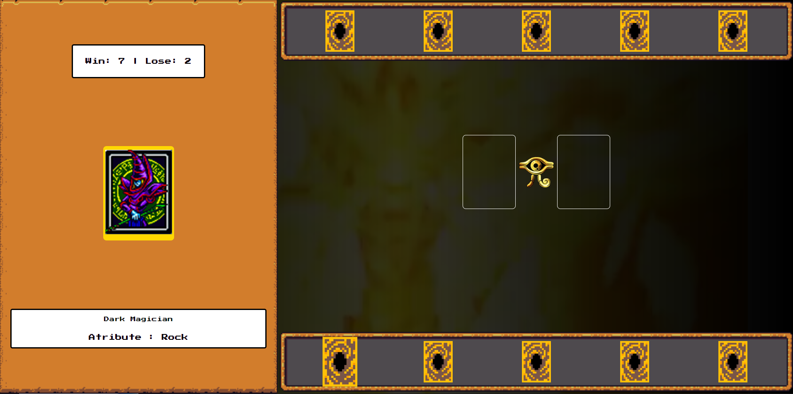

## 🎮 Projeto Jogo Yu-Gi-Oh | Jo-ken-po Edition
Desafio de projeto proposto pelo expert Felipe Aguiar da plataforma da DIO (Digital Innovation One).  
O objetivo desse projeto é criar um jogo da Memória com HTML, CSS e JavaScript.

## 💻 Tecnologias usadas:

  
  
  

## 🖥 Preview do Jogo:

## ⚙ Execução do Jogo:
1. **Clonar Repósitório:** basta utilizar o comando `git clone` para clonar esse projeto e salvar na máquina e depois executar o arquivo `index.html`.

## 🕹 Como jogar:
- O objetivo do jogo consiste em você escolher um das cartas com os atributos Pedra, papel ou tesoura.
- Após escolher a carta, ela vai ser comparada com a carta do adversário (computador).
- Você terá 5 opções de escolha de cartas, ao passar o mouse por cima delas, visualizará ao lado esquerdo a cartas e seus atributos.
